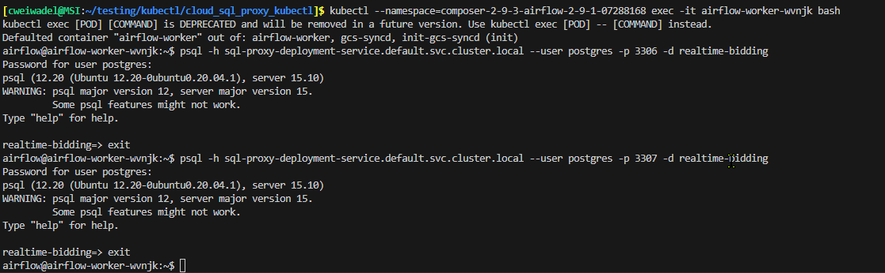

This project both documents and provides a script to ceate a SQL proxy in Google Cloud Composer.  I am assuming you know why you need to create a proxy, as outlined here:

See: [Connect from Google Kubernetes Engine ](https://cloud.google.com/sql/docs/postgres/connect-kubernetes-engine)

Unfortunately, these instructions will not suffice. There are also several blogs on how to do this, but these
seem outdated. Recent versions of Composer use namespaces in kubernetes, so much of the documentation (including that from Google itself) will not work.

The script will create a sql proxy connection for workload identity with the sidecar pattern. 

### Ratequote / Collin Modification
* Updated the `~/scripts/create.py` to handle the use case for the PG Replication
  * It creates the GKE `Deployment` and attached `Service` which uses:
    * A single GKE SA (`ksa_name`) linked to a single GCP SA (`service_account`)
    * To create a single workload/Deployment in GKE
      * Within the `Deployment` it exposes the `cloud-sql-proxy` via the Google cloud sql proxy image
      * It establishes TWO instances to be available:
        * @ `0.0.0.0:3306` --> DEV DB Connection
        * @ `0.0.0.0:3307` --> PROD DB Connection
    * The `Service` attached to the deployment also enables these ports as open/exposed within a single `Service`
      * `3306` --> `name:dev`
      * `3307` --> `name:prod`


Detailed Creation
=================

1. Get the name of your Compser cluster. See the section below if you don't know this.


2. Install the kubectl client:
``` bash
gcloud components install gke-gcloud-auth-plugin
```

3. Create a config.ini file. See the examples

  * `ksa_name`
    * ~~can be anything you want~~
    * Ideally name this as a recognized able Service Acct (SA) on GKE/K8s
  *  `cluster_name`
    * the name of the cluster
  *  `region_name` 
    * name of region id of your cluster
  * `deployment_name`
    * ~~can be anything~~
    * Ideally name this as a recognize-able GKE deployment
  * ~~`db_secret_name`~~
    * ~~Optional, only if you need to create a kubernetes secret; can be anyting~~
  * `db_prod_secret_name`
    * Name (only descriptor) for the secret to create in GKE/K8s
    * If this is specified, the following is used to create the keys (like key-value pair) for the secret
      * `db_name`
      * `db_user_name`
      * Currently does NOT allow for different names of the secrets across env
  * `db_dev_secret_name`
    * Like `db_prod_secret_name` except to name the dev secret(s)
  * `db_instance`
    * Name of the db instance from cloud sql to determine instance connection string (ex. `call-optimizer-db`)
  * `prod_project` 
  * `prod_proxy_port`
    * Port to assign to the cloud sql proxy connection instance str, only affects how clients connect to the proxy for connection to PROD
  * `dev_project`
  * `dev_proxy_port`
    * Port to assign to the cloud sql proxy connection instance str, only affects how clients connect to the proxy for connection to DEV
  * `db_name`
    * ~~Optional, only use if creating a kuberntes secret; the name of db you are connecting to~~
    * Specify when using a `*_secret_name` config to specify the `*_secret_name.database` secret value
  * `db_user_name`
    * ~~Optional, only use if creating a kuberntes secret; the name of db user you are connecting to~~
    * Specify when using a `*_secret_name` config to specify the `*_secret_name.username` secret 
  ~~* `db_port` port of instance~~
  ~~* `instance_connection_name` the name of your Cloud SQL instance, found in GCP console~~
  * `service_account`
    * ~~can be anything~~
    * Set to the NAME of the GCP SA that should be able to access the proxy
      * Just the name (ex. `airflow-bq`) so before the `@<project_id>@iam.google...`
  * `project_id`
    * project id to create the proxy deployment/service in this project's GKE cluster

  ### IMPORTANT
  ++++++++++++++++
  * An implict configuration is required via: `PROXY_DB_PASSWORD_DEV` and `PROXY_DB_PASSWORD_PROD`
    * must be set as env var of the machine running the ~/scripts/create.py
    * These are set dynamically to the appropriate `*_secret_name` based on the presence of either `dev` or `prod`
  
  ++++++++++++++++    

4. Run python scripts/create.py `<path to config>` 
  * use the -v option for verbosity. Default is no messaging. Use 1, 2, or 3 for more verbosity
  * use the -s or --use-secret if you want to create s kubernetes secret
  * use the --yaml / -y flag to build the yaml used to create the GKE infra for validation prior to execution


Testing
=======

Get the identity of the worker pod (where composer has the workers, and where the connection to sql must exist):

```bash
kubectl get pods --all-namespaces
```

In the second column, look for a  name that is something like:  airflow-worker-xxxx. Note the name and the namespace for step 3


2. Check that the service was created 

```bash
kubectl get services --all-namespaces
```

You should see your service

3. connect to the worker pod: 

```bash
kubectl --namespace=<from step1> exec -it <from step 1>  bash

```

For postgres

```
psql -h <service-name>.default.svc.cluster.local --user <user> 
```

Getting Cluster Name
=====================


Click on your instance:


Click on "Environment Configuration"


Scroll down until you see the section "GKE Cluster". You cluster name is the string after the word "/clusters/"


This will be used in the config.ini file (see the examples), as well as for connecting to the cluster.

In addtion, get the region name. In this case, it is "us-west2"

Notes
=====

1. I am not sure creating a kubernetes secret serves any purpose. My understanding is that this secret is mounted in your cluster, so you could access it. But I don't see any place in Google Composer to do so.

2. Google documentation states: "Finally, configure your application to connect using 127.0.0.1". This will not work, because Composer now uses namespaces in kubernetes, and clusters with different namespaces
can't communicate with ech other. Instead, you need the full name: <service_name><namespace>..svc.cluster.local.

3. Google documentation does not state you need to create a service, but apparently, you do. I followed the configuration for airflow-sqlproxy, which needed a service.

4. Google documentation for the yaml file (sidecar) would not work. I had to bind the address of "0.0.0.0" to the proxy to get the service recognized. 


Collin Notes
============

* 
  * Means to connect to airflow cluster:
  ```shell
  kubectl --namespace=composer-2-9-3-airflow-2-9-1-07288168 exec -it airflow-worker-wvnjk bash
  ```
  * Means to connect to the SQL Proxy while on Airflow (useful/required for jobs on airflow)
  ```shell
  psql -h sql-proxy-deployment-service.default.svc.cluster.local --user postgres -p 3306 -d realtime-bidding
  ```
    * `psql-client` seems to exist on Airflow cluster
    * The `sql-proxy-deployment-service.default.svc.cluster.local` is the location of the proxy host
      * The port differentiates whether it will connect to PROD or DEV:
        * `-p 3306` --> DEV
        * `-p 3307` --> PROD
* Docker cloud-sql-proxy image (GCP Provided)
  * Docker run local command and syntax to mimic for Deployment on GKE
  ```shell
  docker run -e GOOGLE_APPLICATION_CREDENTIALS=/tmp/keys/g_creds.json \
      -v $GOOGLE_APPLICATION_CREDENTIALS:/tmp/keys/g_creds.json:ro \
      -p 3307:3307 -p 3306:3306 \
      gcr.io/cloud-sql-connectors/cloud-sql-proxy:2.1.0 \
      --credentials-file /tmp/keys/g_creds.json \
      "ratequote-349719:us-central1:call-optimizer-db?address=0.0.0.0&port=3307" \
      "ratequotedev:us-central1:call-optimizer-db?address=0.0.0.0&port=3306"
  ```